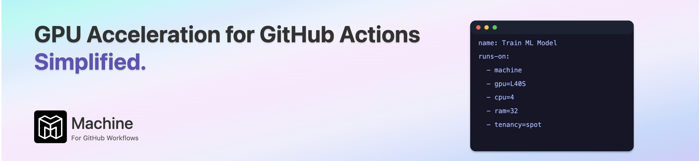

Machine supercharges your GitHub Workflows with seamless GPU acceleration. Say goodbye to the tedious overhead of managing GPU runners and hello to streamlined efficiency. With Machine, developers and organizations can effortlessly scale their AI and machine learning projects, shifting focus from infrastructure headaches to innovation and speed.

# Repo Title

Explanation of the repository.

---

### ✨ **Key Features**

---

### 📁 **Repository Structure**

---

### ▶️ **Getting Started**

---

### 🔑 **Prerequisites**

- GitHub account
- Access to [Machine](https://machine.dev) GPU-powered runners

_No local installation necessary—all processes run directly within GitHub Actions._

---

### 📄 **License**

This repository is available under the [MIT License](LICENSE).

---

### 📌 **Notes**

- This repository is currently open for use as a template. While public forks are encouraged, we are not accepting Pull Requests at this time.

_For questions or concerns, please open an issue._
